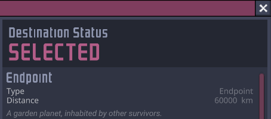
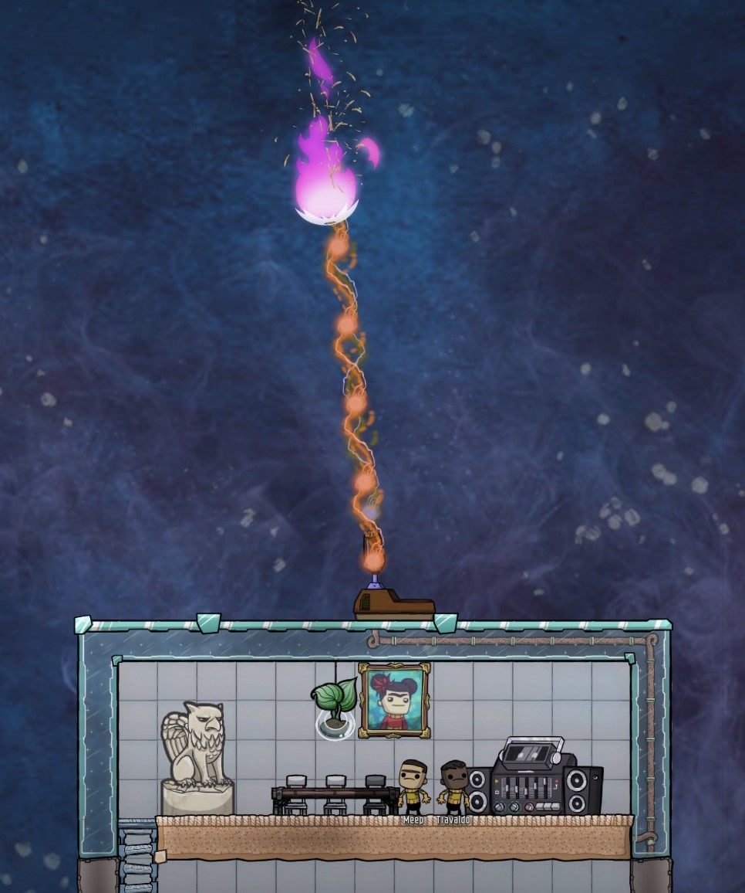
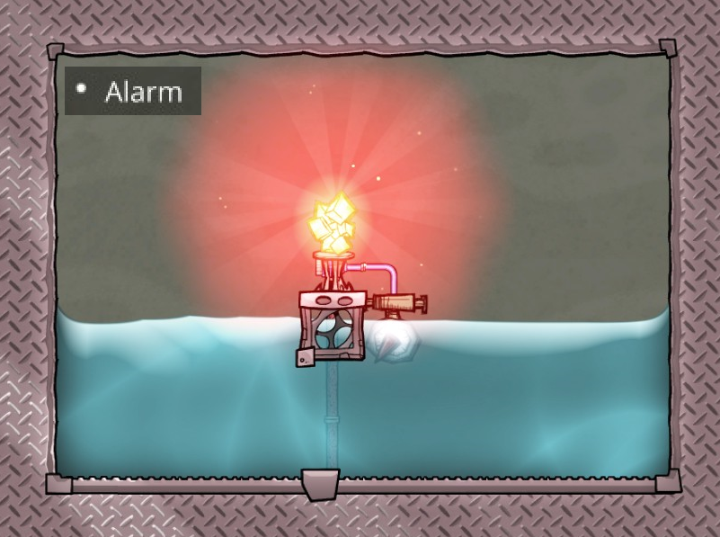
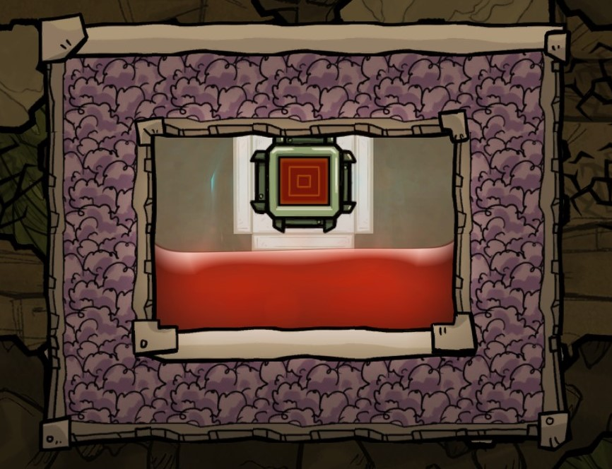

# Oxygen Not Included Mods

Install these mods from the [Steam Workshop](https://steamcommunity.com/profiles/76561197980278821/myworkshopfiles/?appid=457140).

## Endpoint

Escape the asteroid! You can now send duplicants on a one-way flight to Endpoint, a habitable world populated by other survivors. New duplicants gain a +1 bonus to all attributes for each time their type been rescued.

- A special terrestrial planet named "Endpoint" is added at 100000 km.
- Command and Sightseeing modules gain the option to leave duplicants at Endpoint. If set on a Command module the rocket will still return on autopilot.
- The new "Endpoint" button on the main menu lists all the duplicants you've rescued this way.

To clear the history of rescued duplicants, delete the file "Documents\Klei\OxygenNotIncluded\endpoint_state.yaml".

Challenges:

- How quickly can you rescue an entire colony?
- How many duplicants can you send to Endpoint by cycle 400?

## Meteor Defense Laser

Tired of cleaning up regolith? Annihilate incoming meteors with this 20 MDTU/s laser.

Requires significant power to charge.

Unlocked by Celestial Detection.

## Alarm

Displays a notification when activated by the logic input.

Colors:

- Copper: Green
- Iron: Red
- Gold: Yellow
- Tungsten: Blue
- Steel: White
- Niobium: Purple
- Thermium: Orange

Change the alarm's name by clicking on the pencil icon in the details sidescreen, as for a duplicant or storage container. This name will be visible in the notification tooltip.

Sample uses:

- Water reservoir low.
- Oxygen density low.
- Slimelung detected.
- Temperature too high.

Unlocked by Advanced Automation.

## Heating Element

Converts electrical power into heat.

Creates approximately 1 kDTU/W, comparable to a reverse Steam Turbine.

Does not have an arbitrary temperature limit. Instead, it will work until it melts. Depending on the construction material it can operate at up to 3400&deg; C.

Unlocked by Thermal Modulation.